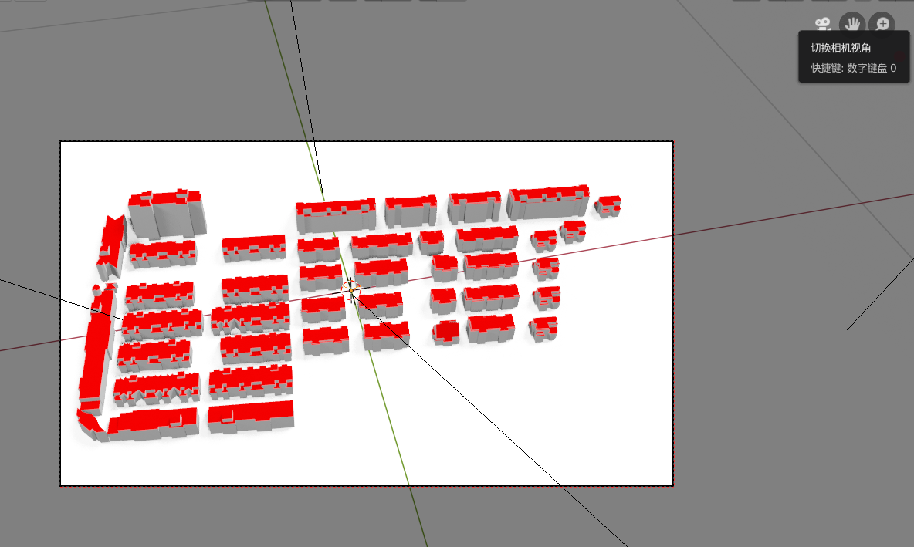
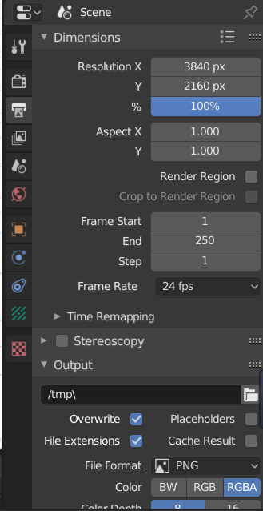

# Blender 2.80 White Model Rendering Addon

## Introduction
- For the white model obtained in photogrammetry modeling, it is usually required to render it for more beautiful display. This addon is able to automatically render the building white model, give the roof a red material, and the building body gives the gray material, automatically adjust the light and so on.

## Main Function
1. The model is scaled to the (0-1) interval for subsequent uploading and display.
2. Adjust the direction of rotation and move the position to the origin.
3. Automatically select the top surface, assign the red material, and select the building body to assign the gray material.
4. Add lighting effects.
5. Set the Freestyle.
6. Set the camera angle lock, set the rendering image resolution.

## Environmental Requirements
- Blender version >= 2.80

## Instructions
- ### Installation
  - Open Blender, click ```Edit->Preferences->Add-ons```, click ```Install``` in the upper right corner, and then select the ```Render.py``` file to be installed to complete the Addon installation.
- ###  Initial environment settings
  - Before importing the model, the environment needs to include the default camera (Camera) and light (Light), as shown below.

    

    tips: After opening the software, there will be a cube in the interface by default. You need to delete it. Selecting it, press the ```X``` key to delete it.
- ### Import model
  - Click ```File->Import``` in the menu bar to import various types of models.
- ### Calling the render command
  - Press ```F3``` to call up the search menu, enter the ```Render WhiteModel``` command, as shown below, press Enter, you can call the command to complete the rendering operation.

    
- ### Adjust camera angle
  - Since the camera view is already locked, you can adjust the angle of view directly in the camera view.

    as the picture shows

    
- ###  Rendering
  - Press ```F12``` or click ```Render->Render Image``` in the menu bar to complete the final rendering and export the image.
- ### Example
  - Import model

    It can be seen that the model originally imported does not know the size, the location, and the direction.

    
  - Call the command

    As shown in the picture, one-click rendering is completed

    
  - Results
    
    - before rendering

      
    - After rendering

      

## Tips：
  - If you do not want to display the edge line, as shown, you can cancel the ```Freestyle``` property check.

    
  - The Addon automatically sets the resolution of the image to 3840*2160. If you want to modify it, you can modify it as shown in the picture.
    
    
  - It may take a long time for more complex models, please be patient.

